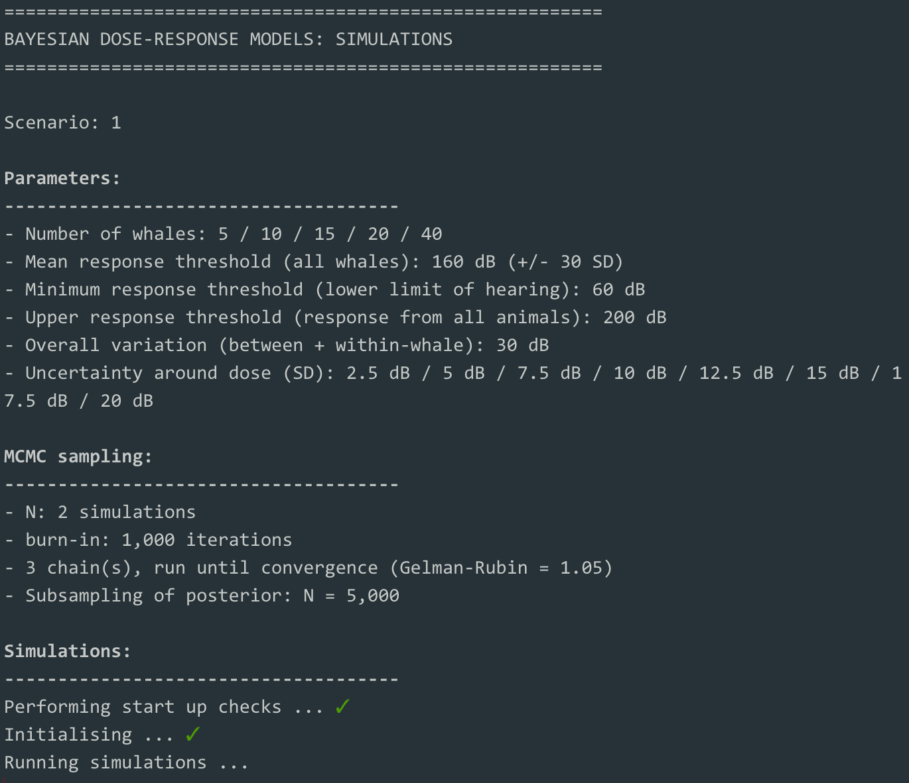
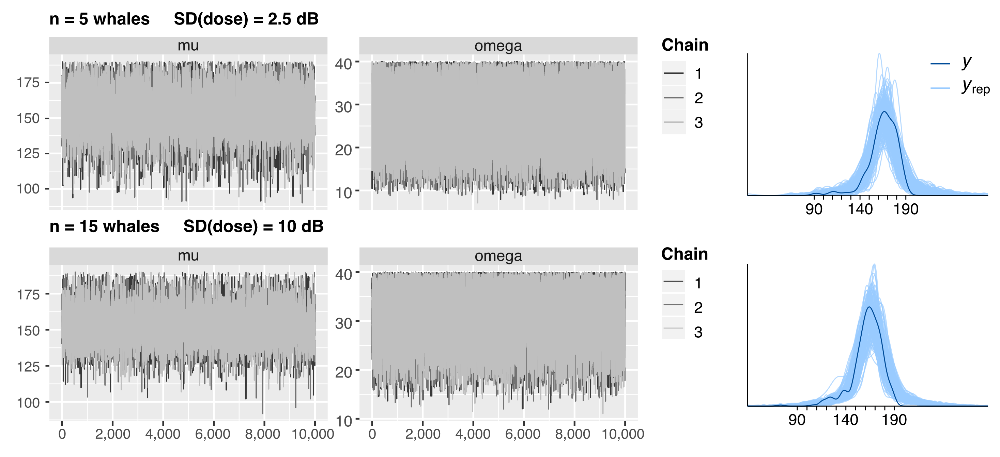
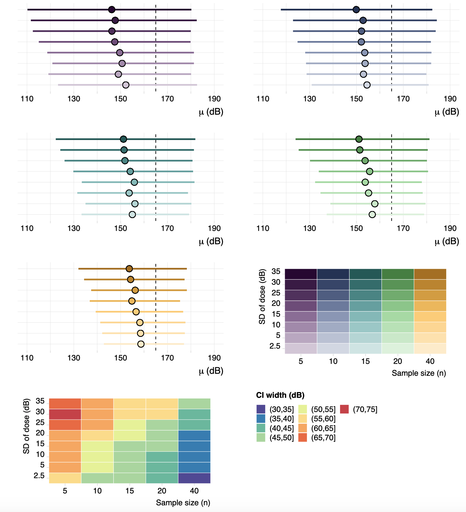
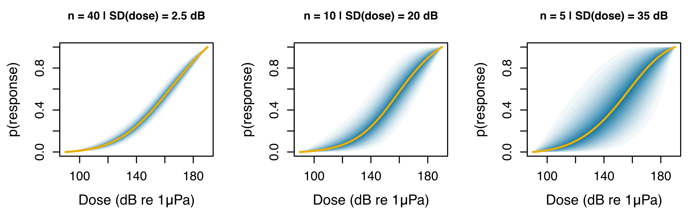
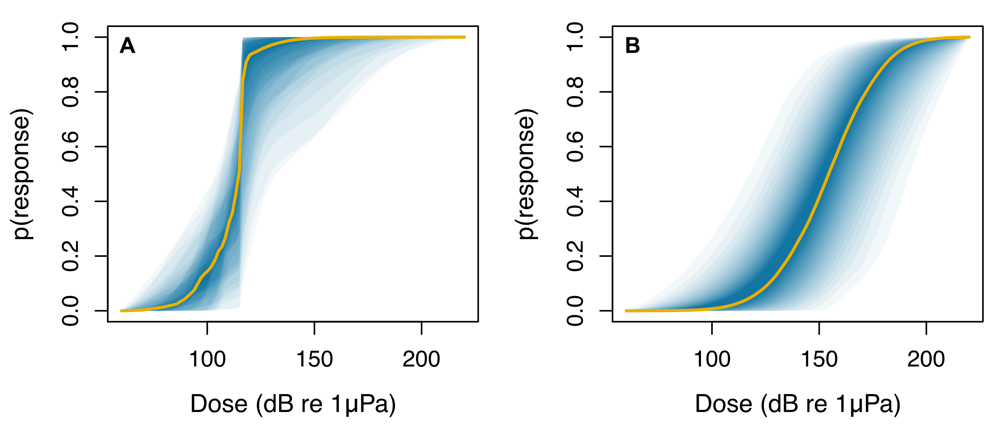

\renewcommand{\figurename}{\textbf{Figure }}
\renewcommand{\caption}{\textbf{Figure }}
\newcommand{\code}[1]{\textcolor{codecolor}{\texttt{\hl{#1}}}}
\setstretch{1.15}

\section{Introduction}

This document describes R functions for simulating cetacean responses to various sonar exposure contexts, within a Bayesian hierarchical modelling framework. The functions are designed to support a sensitivity analysis of the effects of uncertainty in acoustic dose measurements (i.e. received sound levels) on the probability of behavioural response. This work is motivated by the need to assess the utility of different tag types in improving our understanding of dose-response relationships [@Schick2019]. For more details, please refer to the accompanying technical report [@Bouchet2020a]. 

**Note:** The code implements adaptations of the Bayesian hierarchical dose-response model described in @Miller2014, and written in the JAGS dialect of the BUGS language. Model files are stored in the \code{jags} folder within the working directory and are named: \code{BayesianBRSModel\_JAGSsim\_v1.txt} for scenario 1, \code{BayesianBRSModel\_JAGSsim\_v2.txt} for scenario 2 etc.

\subsection{Loading packages}

The [`pacman` package](https://cran.r-project.org/web/packages/pacman/index.html) [@Rinker2018] is a handy tool to load the required libraries, as shown below. The \code{p\_load()} function, used here, automatically installs any packages not already present on the user's machine. Setting the seed of R's random number generator (using \code{set.seed()}, followed by any number) guarantees that simulations or random objects can be reproduced.

Note: \code{pacman} can be installed from CRAN via \code{install.packages("pacman")}. A development version is also available on Github and can be installed by running the command below:

```{r eval=FALSE}
library(devtools); devtools::install_github("trinker/pacman")
```

```{r eval=FALSE}
#'--------------------------------------------------------------------
# Load required libraries
#'--------------------------------------------------------------------
pacman::p_load(rjags,          # Bayesian graphical models using MCMC
               coda,           # Output analysis and diagnostics for MCMC
               MASS,           # Support functions for applied statistics
               truncnorm,      # Truncated Normal
               tidyverse,      # R packages for data science
               lubridate,      # Dates and times made easy
               parallel,       # Support for parallel computation
               doParallel,     # Parallel backend for the foreach/%dopar% function
               utils,          # R utility functions
               pals,           # Comprehensive palettes and palette evaluation tools
               viridisLite,    # Viridis colour palette
               ArgumentCheck,  # Improved communication re problems in function arguments         
               crayon,         # Colored terminal output
               ggnewscale,     # Multiple colour scales in ggplot2
               MCMCvis,        # Visualise, manipulate, and summarise MCMC output
               HDInterval,     # Highest (Posterior) Density Intervals 
               reshape2,       # Flexibly reshape data
               bayesplot,      # Plotting for Bayesian Models
               gridExtra,      # Miscellaneous functions for "grid" graphics
               ggpubr,         # Tools for publication ready plots
               plyr,           # The split-apply-combine paradigm for R
               rlang,          # Tools for core language features of R and the tidyverse
               ggridges,       # Ridgeline plots with ggplot2
               hms,            # Pretty time of day
               cowplot,        # Add-on for complex ggplot
               grDevices,      # R Graphics Devices and Support for Colours and Fonts
               tictoc)         # Functions for timing
      
set.seed(75) # Set the random seed
```

\pagebreak

\subsection{Importing bespoke functions}

All required functions are stored in the \code{BayesianBR\_simulation\_functions.R} file, and must first be imported into the R workspace.

```{r}
#'--------------------------------------------------------------------
# Load required functions
#'--------------------------------------------------------------------
source('../BayesianBR_simulation_functions.R')
```

```{r include=FALSE}
library(kableExtra) # Table outputs for R Markdown
```

\subsection{Simulation scenarios}

Four simulation scenarios of increasing complexity are considered [see @Bouchet2020a]. These differ in (i) their observation model, i.e. the treatment of errors relating to the measurements of acoustic dose (either fixed for all animals, or varying by tag type), and (ii) the complexity of the model structure, i.e. which either allows covariate effects and multiple exposure sessions, or not. The true underlying mean response threshold (for all whales), $\mu$, is chosen as the received sound pressure level (SPL) corresponding to a p(response) = 0.5 for a "typical odontocete", in line with existing biphasic response curves (for relevant code, see https://github.com/pjbouchet/dose-response/tree/master/biphasic). This gives a true $\mu$ = 165 dB re 1 $\mu$Pa, which is broadly consistent with the values used in @Miller2014, @Schick2019, and other studies. Between-animal variation is set to $\phi$ = 20 dB re 1 $\mu$Pa by default (but can be changed, if necessary). Likewise, the within-whale variation takes the value of $\sigma$ = 25 dB. As variances add, the overall combined variation $\omega$ is equal to $\sqrt{{\phi}^2 + {\sigma}^2}\approx$ 30 dB. A range of sample sizes is tested, from n = 5 to n = 40 individuals. Errors in dose measurements are expressed as standard deviations in received SPL, and fall along a spectrum from 2.5 dB to 35 dB. The lower bound reflects typical errors observed on DTAGs (Isojunno & Wensveen, personal communication), while the upper bound is consistent with estimates from sattelite-tagged whales [@Schick2019; @Joyce2020].

\section{Code}

\subsection{Overview}

The code proceeds in 10 steps:

\setlist[itemize]{leftmargin=*}

+ **Step 1: Perform initial checks.** A number of sanity checks are implemented to ensure that input parameters are correctly specified. For instance, an error is returned if \code{lower.bound} exceeds \code{upper.bound}, and a warning issued if the desired number of cores exceeds the capacity of the processor (by default, the maximum number of cores is then used in this case). In addition, relevent folders are created on disk (if not already present) to store simulation outputs. These contain an index (.txt) file, used to assign a unique identifying number to each simulation run.

+ **Step 2: Run simulations.** The simulations are run in parallel on as many cores as specified by \code{parallel.cores}. Simulated observations are generated for every combination of \code{n.whales} x \code{uncertainty.dose} (in scenarios 1 and 2) or \code{n.whales} x \code{prop.sat} (in scenarios 3 and 4), and the hierarchical model corresponding to the relevant \code{scenario} is compiled and executed using the [`rjags`](https://CRAN.R-project.org/package=rjags) package [@Plummer2019]. Setting \code{verbose = TRUE} ensures that a text-based summary of simulation parameters/steps is printed to the R console during execution (Figure \hyperlink{fig1}{1}). As a reminder, analyses in \code{rjags} follow a standard structure:

1. Define the model using the BUGS language in a separate text file (here, model files are saved in the in the \code{jags} folder).
2. Read in the model file using the \code{jags.model()} function. This creates an object of class \code{jags}.
3. Update the model using the \code{update} method for \code{jags} objects. This constitutes a 'burn-in' period.
4. Extract samples from the model object using the \code{coda.samples()} function. This creates an object of class \code{mcmc.list} which can be used to summarize the posterior distribution.

(ref:captionfig1) **1:** \hypertarget{fig1}{}A simulation overview is returned in the R console when `verbose = TRUE`.

```{r fig1, echo=FALSE, fig.show='hold', cache = TRUE, out.width = '70%', fig.align='center', fig.cap = "(ref:captionfig1)"}

```

Note that automatic MCMC run length and convergence diagnostics are available from the [`runjags`](https://cran.r-project.org/web/packages/runjags/index.html) package [@Denwood2016], and can be invoked with \code{mcmc.auto = TRUE}. This kind of adaptive approach can be helpful here as convergence tends to be slower with increasing errors in dose measurements, such that setting a constant chain length would not guarantee convergence in all simulations (and/or be inefficient). However, in our experience, timeout issues can occur with \code{mcmc.auto = TRUE} when the number of combinations of \code{n.whales} x \code{uncertainty.dose/prop.sat} x \code{n.sim} is large. One solution is to loop through simulations for each individual pair of \code{n.whales} x \code{uncertainty.dose/prop.sat} separately. The results can then be compiled using the \code{compile\_sim()} function (\hyperlink{compilelink}{see section 2.3}).

+ **Step 3: Post-processing and compiling.** This is largely convenience code used to extract and format MCMC outputs. Note that in order to circumvent memory problems during subsequent calculations (particularly when running long chains and a large number of simulations), the final posterior samples are obtained from an additional update of the Markov chains after convergence (using \code{mcmc.n} iterations).

+ **Step 4: Effective response range.** Next, the code produces posterior estimates of the effective response range (or effective response radius, ERR). The ERR is a novel metric that combines information on animal distribution, dose-response relationships, sound source levels, and models of acoustic propagation, to produce more robust and accurate estimates of impact [@Tyack2019]. See \hyperlink{err}{section 2.3} for more details.

+ **Step 5: Dose-response curves.** Similarly, dose-response curves are computed for each simulation from pairs of posterior estimates of $\mu$ and $\omega$ (or $\phi$ and $\sigma$). Summary statistics (i.e. median, quantiles) are saved and will be used for plotting using \code{plot\_doseresponse()}.

+ **Step 6: Effective sample sizes and autocorrelation.** MCMC samples must be representative of the posterior distribution, however most MCMC chains exhibit some level of autocorrelation, such that successive steps in the chains are not independent. This section uses the \code{effectiveSize()} and the \code{autocorr.diag()} functions from the [`coda`](https://cran.r-project.org/web/packages/coda/index.html) package [@Plummer2019b] to assess chain autocorrelation and calculate effective sample sizes (ESS) as a metric of chain length for each parameter [@Kruschke2010]. The mean ESS for each combination of \code{n.whales} x \code{uncertainty.dose} or \code{n.whales} x \code{prop.sat} (across all simulations) is calculated, and a warning issued if resulting values are inferior to \code{min.ESS}. @Kruschke2010 recommends a heuristic threshold of \code{ESS = 10,000} for achieving numerically stable estimates. However, it may be computationally inefficient to run chains for that long, and \code{min.ESS} thus defaults to \code{1,000}. Similarly, a warning is returned if the mean correlation coefficient for any combination of \code{n.whales} x \code{uncertainty.dose} (or x \code{prop.sat}) x lag > \code{0.2}.

+ **Step 7: Convergence diagnostics.** The code performs both numerical and visual convergence checks (Figure \hyperlink{fig2}{2}), in the form of trace plots (saved to disk) and Gelman-Rubin statistics, respectively. The latter, denoted \code{Rhat}, compares the between-chain variance to the within-chain variance and is generally taken to indicate successful convergence when \code{Rhat < 1.1}. For a more conservative assessment, the default value of \code{Rhat} is set to \code{mcmc.gelmanrubin = 1.05}. Trace plots are produced using the \code{mcmc\_trace()} function from the [`bayesplot`](https://cran.r-project.org/web/packages/bayesplot/index.html) package [@Gabry2019] and \code{Rhat} values obtained using the \code{gelman.diag()} function from the [`coda`](https://cran.r-project.org/web/packages/coda/index.html) package [@Plummer2019b].

+ **Step 8: Posterior predictive checks.** Two types of additional checks are considered next, namely: (1) the posterior prior overlap (PPO), and (2) posterior predictive checks (PPC) (Figure \hyperlink{fig2}{2}). Checking the PPO has particular utility when trying to determine if the parameters in a model are identifiable. If substantial PPO exists, the prior may simply be dictating the posterior distribution, and the data may thus have little influence on the results. By contrast, if a small degree of PPO exists, the data are informative enough to overcome the influence of the prior. In the field of ecology, nonidentifiability is a particular concern in some types of mark-recapture models. @Gimenez2009 suggest that a PPO > 35% indicates weak identifiability. PPCs simulate replicated data under the fitted model and then compare these to the observed data. PPCs are useful for determining whether a model gives "valid" predictions about the reality - i.e. whether predictions are consistent with observed data. PPOs are computed using the \code{MCMCtrace()} function from the [`MCMCvis`](https://cran.r-project.org/web/packages/MCMCvis/index.html) package [@Youngflesh2018] and a warning issued if the PPO for any simulation is less than 0.35. PPC plots (saved to disk) are generated using the \code{ppc\_densoverlay()} function, which is adapted from \code{ppc\_dens\_overlay()} from the [`bayesplot`](https://cran.r-project.org/web/packages/bayesplot/index.html) package [@Gabry2019].

+ **Step 9: Percent relative (median) bias.** This part of the code computes the percent relative (mean/median) bias for each simulation, as a measure of the average tendency of simulated values to depart from the true ones (for each parameter of interest). The mean bias is given as \code{(posterior mean - true value)/true value * 100}. The median bias is identical, but based on the posterior median rather than the posterior mean. It is defined as \code{(posterior median - true value)/true value * 100}.

+ **Step 10: Save outputs.** Lastly, all relevant outputs are saved to a list object. In addition, a summary of the simulation can be written to disk as a text file by setting \code{save.textsummary = TRUE}. Optionally, results can also be saved to disk using \code{save.results = TRUE}.

(ref:captionfig2) **2:** \hypertarget{fig2}{}Example graphical model checks performed during simulations. **Left:** Trace plots used in assessing MCMC chain convergence. **Right:** posterior predictive plots comparing the distribution of observations simulated from the fitted model to that of the observed data.
```{r echo=FALSE, fig.show='hold', cache = TRUE, out.width = '100%', fig.align='center', fig.cap = "(ref:captionfig2)"}

```

\subsection{Running simulations}

\subsubsection{run\_scenario()}

This is the core function used for running simulations using Markov Chain Monte Carlo (MCMC). Its arguments are listed below:

\renewcommand{\arraystretch}{1.4}
```{r echo=FALSE}
text_tbl <- data.frame(
  Argument = c("scenario", 
               "n.sim", 
               "n.whales", 
               "n.trials.per.whale", 
               "uncertainty.dose", 
               "prop.sat", 
               "dtag.sd", 
               "source.level", 
               "species.argos", 
               "true.mu", 
               "lower.bound", 
               "upper.bound", 
               "true.omega", 
               "omega.upper.bound",
               "true.phi", 
               "phi.upper.bound", 
               "true.sigma", 
               "sigma.upper.bound",
               "true.alpha",
               "alpha.sd", 
               "true.beta", 
               "beta.sd",
               "censor.right", 
               "burn.in", 
               "mcmc.adapt",
               "mcmc.chains",
               "mcmc.thin", 
               "mcmc.n", 
               "mcmc.auto", 
               "mcmc.gelmanrubin",
               "mcmc.save",
               "animal.density", 
               "n.bins", 
               "check.convergence",
               "gr.multivariate", 
               "posterior.checks", 
               "min.ESS", 
               "correlation.threshold",
               "save.trace",
               "no.tracePlots", 
               "n.yrep", 
               "hdi.value", 
               "verbose", 
               "parallel.cores",
               "record.time", 
               "save.textsummary",
               "save.results"),
  Description = c("Scenario ID. Must be an integer between 1 and 4.",
                  "Integer. Number of simulations to run.",
                  "Integer. Number of whales. Can be supplied as a single value or vector of integers, which will be assessed iteratively.",
                  "Integer. Number of exposure sessions per animal.",
                  "Uncertainty in acoustic dose, expressed as a standard deviation in received sound levels (in dB). Can be supplied as a single value, or vector of integers, which will be assessed iteratively. Relevant only to scenarios 1 and 2.",
                  "Proportion of animals fitted with satellite tags. Can be supplied as a single value, or vector of values between 0 and 100, which will be assessed iteratively. Relevant only to scenarios 3 and 4.",
                  "Uncertainty in dose measurements made on DTAGs within scenarios 3 and 4, expressed as a standard deviation in received sound levels (in dB). Defaults to 2.5 dB.",
                  "Source level of the sonar. Defaults to 210 dB re 1μPa m at a nominal frequency of 3 kHz, as per Tyack & Thomas (2019).",
                  "Cetacean species to simulate in scenarios 3 and 4. One of either 'Zc' for Cuvier's beaked whale (Ziphius cavirostris) or 'Gm' for short-finned pilot whale (Globicephala macrorhynchus). ARGOS ellipses are simulated for each species based on real data from tagged animals (courtesy of Rob Schick at Duke University).",
                  "True underlying mean response threshold for all whales. Follows a truncated Normal with lower and upper truncation points given by lower.bound and upper.bound.",
                  "Lower bound for true.mu, i.e. minimum response threshold. Defaults to 60 dB, under the conservative assumption that any sound below this threshold will not be heard for a 'typical' odontocete above ambient noise (Schick et al. 2019).",
                  "Upper bound for true.mu, i.e. threshold at which all whales are expected to respond. Defaults to 190 dB for a typical odontocete.",
                  "Combined (between and within-whale) variation (SD). Relevant to scenarios 1 and 3.", 
                  "Upper bound for true.omega.",
                  "Between-whale variation (SD). Defaults to 20 dB. Relevant to scenarios 2 and 4.",
                  "Upper bound for true.phi.",
                  "Within-whale variation (SD). Relevant to scenarios 2 and 4.",
                  "Upper bound for true.sigma.",
                  "Parameter representing the effect of previous exposure to sonar on the animals' response threshold. Follows a Normal distribution with standard deviation given by alpha.sd.",
                  "Standard deviation of the exposure effect (true.alpha).",
                  "Parameter governing the effect of MFAS (Mid-frequency active sonar) relative to LFAS (Low-frequency active sonar) on the animals' response threshold. Follows a Normal distribution with standard deviation given by beta.sd.",
                  "Standard deviation of the MFAS effect (true.beta).",
                  "Right-censoring range. Must be a vector of two values representing the lower and upper bounds, respectively. In each simulation, a value is drawn from a Uniform distribution bounded by this range, and any observation above this threshold is set to NA.",
                  "Number of Markov Chain Monte Carlo (MCMC) iterations required to achieve chain convergence. These will be discarded (burn-in). When mcmc.auto is set to {TRUE, an initial burn-in of 5,000 is applied, and the autorun.jags function triggered, ensuring that all chains converge before they are returned.",
                  "Number of iterations used for adaptation. When a JAGS model is compiled, it may require an initial sampling phase during which the samplers adapt their behaviour to maximize their efficiency (e.g. a Metropolis-Hastings random walk algorithm may change its step size). The sequence of samples generated during this adaptive phase is not a Markov chain, and therefore may not be used for posterior inference on the model.",
                  "Number of MCMC chains. Defaults to 3.",
                  "Thinning rate. Thinning is used to reduce autocorrelation in the MCMC posterior sample, by only retaining every mcmc.thin^{th} value.",
                  "Integer. Number of MCMC samples extracted after convergence.",
                  "Logical. Run the MCMC model in JAGS with automatically run length and convergence diagnostics, using the runjags package.",
                  "Threshold for assessing chain convergence according to the Gelman-Rubin statistic. Defaults to 1.1.",
                  "Logical. Whether to save MCMC samples to disk (in .rds format). Warning: Setting this argument to TRUE may result in large output files, if a high number of simulations is required.",
                  "Number of whales per square km. Used in the calculation of the effective response range (ERR). Defaults to 1.",
                  "Number of bins used in the calculation of the effective response range (ERR). Defaults to 500.",
                  "Logical. Whether to perform convergence checks on MCMC chains, including calculating values of the Gelman-Rubin statistic and producing trace plots. Defaults to TRUE.",
                  "Logical. If TRUE, the multivariate Gelman-Rubin statistic is returned.",
                  "Logical. Whether to perform posterior checks, including PPO: Prior posterior overlap; PPC: Posterior predictive checks. Defaults to TRUE.",
                  "Minimum effective sample size (ESS) considered to be acceptable. A warning will be issued if this value is not attained for each parameter. Defaults to 1000.",
                  "Threshold for assessing MCMC chain correlation. If this value is exceeded for any lag, a warning will be triggered.",
                  "Logical. Whether to save a subset of trace plots to disk.",
                  "Integer between 1 and 5. Number of simulations (chosen at random) for which to produce trace plots when check.convergence is TRUE.",
                  "Number of replicate datasets to generate for posterior predictive checking (posterior.checks = TRUE).",
                  "Probability mass to include in credible intervals derived as highest density intervals. Must be a number between 0 and 1. Defaults to 0.95 for a 95% HDI.",
                  "Logical. Whether to prints an overview of simulation parameters/steps to the R console during execution. Defaults to TRUE.",
                  "Integer. Number of cores to use when computations are run in parallel. Default is 1 for single core computing.",
                  "Logical. Whether to time the simulations. Defaults to TRUE.",
                  "Logical. If TRUE, a text-based summary of simulation parameters will be saved on disk.",
                  "Logical. Whether to save the simulations outputs as an .RData file on disk. Defaults to TRUE."))

text_tbl %>% 
  knitr::kable(., "latex", booktabs = TRUE, longtable = TRUE) %>%
  kableExtra::kable_styling(full_width = FALSE, latex_options = c("hold_position", "repeat_header")) %>%
  kableExtra::row_spec(0, bold = TRUE) %>% 
  kableExtra::column_spec(1, bold = TRUE, border_right = TRUE) %>%
  kableExtra::column_spec(2, width = "30em")
```

\pagebreak
\subsection{Visualising outputs}
The following functions are available for visualising and summarising simulation results.

\subsubsection{plot\_results()}

This function produces forest plots (Figure \hyperlink{fig3}{3}) showing the average (i) posterior median and (ii) credible interval bounds for parameters of interest across simulation runs. A bivariate colour legend is used to characterise combinations of \code{n.whales} x \code{uncertainty.dose} or \code{n.whales} x \code{prop.sat}, depending on the scenario considered and as defined in \code{run\_scenario()}. Each sample size is given a hue along the \code{viridis} colour scale, and each measurement error/tag ratio is given a different shade, with lower values shown in lighter tones, and higher values in darker tones. In addition, heat maps (coloured grids) are produced to show patterns in the average (i) credible interval width (in dB re 1$\mu$Pa or km, as appropriate), (ii) percent relative bias, and (iii) prior posterior overlap (PPO) for each combination of sample size and error/tag ratio, for a given parameter. These plots are saved both individually and in a combined PDF on disk.

(ref:captionfig3) **3:**  \hypertarget{fig3}{}Example forest plot produced by the `plot_results()` function for the mean response threshold across all whales, $\mu$, under scenario 1.

```{r echo=FALSE, fig.show='hold', cache = TRUE, out.width = '80%', fig.align='center', fig.cap = "(ref:captionfig3)"}

```

\renewcommand{\arraystretch}{1.4}
```{r echo=FALSE}
text_tbl <- data.frame(
  Argument = c("mcmc.object","layout.ncol", "pars.to.plot", "select.n", "select.obs", "summary.method", "start.shade", "n.cols", "darken.bars", "save.to.disk", "output.format"),
  Description = c("List object containing simulation outputs, as returned by simulate_scenario().",
                  "Number of columns used in the final plot layout. Must be an integer between 1 and 3.",
                  "Parameter(s) of interest. By default, the function will produce plots for every monitored parameter (param = NULL).",
                      "Subset of sample sizes to display. All values are shown when set to NULL (the default).",
    "Subset of values to display for the observation model parameter (i.e. uncertainty.dose in scenarios 1 and 2, prop.sat in scenarios 3 and 4). All values are shown when set to NULL (the default).",
                  "Character vector. One of 'mean' or 'median'. Whether to calculate the average or median value of posterior statistics across simulations.",
    "Number between 0 and 1 indicating the shade of the lightest to use on the Y-axis. Higher values indicate darker shades. Defaults to 0.2.",
     "Integer. Minimum number of colours used to define the colour palettes of the heat plots.",
    "Logical. Whether to add dark lines to the plot to enhance the legibility of the lightest colours. Defaults to FALSE.",
    "Logical. Whether to save the plots to disk. Defaults to FALSE.",
    "Output file type. Defaults to 'pdf'."))

text_tbl %>% 
  knitr::kable(., "latex", booktabs = TRUE, longtable = TRUE) %>%
  kableExtra::kable_styling(full_width = FALSE) %>%
  kableExtra::row_spec(0, bold = TRUE) %>% 
  kableExtra::column_spec(1, bold = TRUE, border_right = TRUE) %>%
  kableExtra::column_spec(2, width = "30em")
```

\subsubsection{plot\_doseresponse()}

This function generates dose-response plots such as those presented in @Miller2014 and @Harris2018 (Figure \hyperlink{fig4}{4}). By default, one plot is produced per combination of \code{n.whales} x \code{uncertainty.dose} or \code{n.whales} x \code{prop.sat}, however various parameters are available to select combinations of interest and modify the layout of the output file.  

\renewcommand{\arraystretch}{1.4}

```{r echo=FALSE}
text_tbl <- data.frame(
  Argument = c("mcmc.object", "select.n", "select.obs", "concatenate", "n.row", "n.col", "save.to.disk", "output.format", "plot.width", "plot.height", "plot.res"),
  Description = c("List object containing simulation outputs, as returned by simulate_scenario().",
    "Subset of sample sizes to display. All values are shown when set to NULL (the default).",
    "Subset of values to display for the observation model parameter (i.e. uncertainty.dose in scenarios 1 and 2, prop.sat in scenarios 3 and 4). All values are shown when set to NULL (the default).",
    "Logical. By default, plots for each sample size are saved on separate pages when output to PDF, which can result in unnecessary empty space depending on the type of layout chosen (n.row x n.col). Set this argument to TRUE to combine plots across a minimum number of pages.",
    "Number of rows used in the plot layout. Values greater than 1 (default) allow multiple plots to be arranged in the same plotting space.",
    "Number of columns used in the plot layout. Values greater than 1 (default) allow multiple plots to be arranged in the same plotting space.",
    "Logical. Whether to save the plots to disk. Defaults to FALSE.",
    "Output file type. Defaults to 'pdf'.",
    "Width of the output plot (in pixels).",
    "Height of the output plot (in pixels).",
    "Resolution of the output plot (in dpi)."))

text_tbl %>% 
  knitr::kable(., "latex", booktabs = TRUE, longtable = TRUE) %>%
  kableExtra::kable_styling(full_width = FALSE) %>%
  kableExtra::row_spec(0, bold = TRUE) %>% 
  kableExtra::column_spec(1, bold = TRUE, border_right = TRUE) %>%
  kableExtra::column_spec(2, width = "30em")
```

(ref:captionfig4) **4:** \hypertarget{fig4}{}Example dose-response curves produced by the `plot_doseresponse()` function.

```{r echo=FALSE, fig.show='hold', fig.align='center', out.width='100%', fig.cap = "(ref:captionfig4)"}

```

\subsection{Convenience functions}

\subsubsection{extra\_sim()}

This function can be called to run additional simulations, for combinations of \code{n.whales} x \code{uncertainty.dose} or \code{n.whales} x \code{prop.sat} in which not all MCMC chains converged for all parameters. A tally of convergence failures is saved by default in the output from \code{run\_scenario()} under \code{\$convergence}. The function launches an internal call to \code{run\_scenario()} with \code{mcmc.auto} set to \code{TRUE}, such that posterior samples are automatically returned after convergence has been achieved. The \code{replace.sims} argument allows users to update the simulation results as appropriate (see Figure \hyperlink{fig5}{5}).

\renewcommand{\arraystretch}{1.4}
```{r echo=FALSE}
text_tbl <- data.frame(
  Argument = c("mcmc.object", "replace.sims", "update.dr"),
  Description = c("List object containing simulation outputs, as returned by simulate_scenario().",
    "Logical. If FALSE, the function only returns the output of run_scenario() for the combinations of n.whales x uncertainty.dose/prop.sat for which convergence was not achieved. If TRUE, the entire mcmc.object is updated with the new results (i.e. including posterior values, summaries, etc).", "Logical. If TRUE, dose-response curves are also updated. Note: This requires MCMC sample objects to have been saved on disk (mcmc.save = TRUE in run_scenario()). "))

text_tbl %>% 
  knitr::kable(., "latex", booktabs = TRUE, longtable = TRUE) %>%
  kableExtra::kable_styling(full_width = FALSE) %>%
  kableExtra::row_spec(0, bold = TRUE) %>% 
  kableExtra::column_spec(1, bold = TRUE, border_right = TRUE) %>%
  kableExtra::column_spec(2, width = "30em")
```

(ref:captionfig5) **5:** \hypertarget{fig5}{}Dose-response curves obtained before and after updates from the `extra_sim()` function. **(A)** Curves derived from simulations in which MCMC chains did not converge for all parameters. **(B)** The same data, after the relevant simulations were corrected to achieved convergence.

```{r echo=FALSE, fig.show='hold', fig.align='center', out.width='90%', fig.cap = "(ref:captionfig5)"}

```

\hypertarget{err}{}
\subsubsection{effective\_range()}

This function is called by \code{run\_scenario()} to calculate the effective response range (or effective response radius, ERR), a novel metric that combines information on animal distribution, dose-response relationships, sound source levels, and models of acoustic propagation, to produce more robust and accurate estimates of impact [@Tyack2019]. By default, the function assumes a simple inverse-squared circular transmission loss model, and performs calculations over a maximum range given by the distance at which received levels drops below \code{lower.bound} (i.e. such that the probability of response is zero).

\renewcommand{\arraystretch}{1.4}
```{r echo=FALSE}
text_tbl <- data.frame(
  Argument = c("response.threshold", "response.sd", "response.lowerbound", "response.upperbound", "received.level", "D", "n.bins", "absorption.loss"),
  Description = c("Mean response threshold (received sound level at which a response is trigerred), in dB re 1uPa rms.",
    "Uncertainty around the response threshold, expressed as a standard deviation of response.threshold.",
    "Received level below which no animals respond, in dB re 1uPa rms.",
    "Received level at which all animals are expected to exhibit a response, in dB re 1uPa rms.",
    "Received levels, reflecting a given source level and transmission loss model.",
    "Animal density. Defaults to 1 animal per km2, as per the example presented in Tyack & Thomas (2019).",
    "Number of bins with which to divide the maximum.rge. The number of whales showing a response is evaluated in each bin.",
    "Maximum range for sound propagation (km)."))

text_tbl %>% 
  knitr::kable(., "latex", booktabs = TRUE, longtable = TRUE) %>%
  kableExtra::kable_styling(full_width = FALSE) %>%
  kableExtra::row_spec(0, bold = TRUE) %>% 
  kableExtra::column_spec(1, bold = TRUE, border_right = TRUE) %>%
  kableExtra::column_spec(2, width = "30em")
```

\hypertarget{xy}{}
\subsubsection{xy\_error()}

This function calculates the uncertainty (SD) in the acoustic dose received by animals fitted with satellite tags, whilst accounting for positional uncertainty on a 2D plane. This is done by simulating candidate ARGOS (x,y) locations within plausible error ellipses around position estimates for a given received level, assuming a simple inverse\-squared spherical transmission loss model. See @Bouchet2020a for details.

\renewcommand{\arraystretch}{1.4}
```{r echo=FALSE}
text_tbl <- data.frame(
  Argument = c("argos.data", "received.lvl", "source.lvl", "multi", "n.ellipses", "plot.ellipse"),
  Description = c("Input ARGOS data.", "Received level.", "Sound pressure level of the noise source.", "Logical. If TRUE, repeat the estimation for multiple ellipses.", "Number of ellipses to simulate when multi = TRUE.", "Logical. If TRUE, create plot a random realisation of the bivariate normal from which simulated errors are drawn."))

text_tbl %>% 
  knitr::kable(., "latex", booktabs = TRUE) %>%
  kableExtra::kable_styling(full_width = FALSE) %>%
  kableExtra::row_spec(0, bold = TRUE) %>% 
  kableExtra::column_spec(1, bold = TRUE, border_right = TRUE) %>%
  kableExtra::column_spec(2, width = "30em")
```

\subsubsection{run\_argos\_example()}

This function is used to produce Figure 16 in the accomnpanying technical report [@Bouchet2020a]. It simulates animals at incremental distances from the sonar source and computes the variation in received levels experienced by these animals, accounting for variable positional error from Argos-linked satellite tags.

\renewcommand{\arraystretch}{1.4}

```{r echo=FALSE}
text_tbl <- data.frame(
  Argument = c("N", "range.min", "range.max", "range.increment", "source.lvl"),
  Description = c("Number of simulated animals.", "Minimum distance from the noise source.", "Maximum distance from the noise source.", "Increments by which to divide the range.", "Level of the noise source."))

text_tbl %>% 
  knitr::kable(., "latex", booktabs = TRUE) %>%
  kableExtra::kable_styling(full_width = FALSE) %>%
  kableExtra::row_spec(0, bold = TRUE) %>% 
  kableExtra::column_spec(1, bold = TRUE, border_right = TRUE) %>%
  kableExtra::column_spec(2, width = "30em")
```


\subsubsection{load\_sim() and compile\_sim()}

\hypertarget{compilelink}{}
These two functions are used to load the results from a single simulation run (provided they have been saved to disk), and compile the results from multiple simulation runs, respectively. The latter is useful when multiple combinations of \code{n.whales} x \code{uncertainty.dose} or \code{n.whales} x \code{prop.sat} have been run separately, and need to be collated.

\renewcommand{\arraystretch}{1.4}
```{r echo=FALSE}
text_tbl <- data.frame(
  Argument = c("scenario", "index"),
  Description = c("Scenario ID.", "Simulation index ID."))

text_tbl %>% 
  knitr::kable(., "latex", booktabs = TRUE) %>%
  kableExtra::kable_styling(full_width = FALSE) %>%
  kableExtra::row_spec(0, bold = TRUE) %>% 
  kableExtra::column_spec(1, bold = TRUE, border_right = TRUE) %>%
  kableExtra::column_spec(2, width = "30em")
```

\subsubsection{hexa2hex()}

This function returns the HEX colour code equivalent to an input colour subjected to a given level of transparency. 
This is useful for emulating different opacity levels for overlapping plot elements without actually making them transparent. \code{hexa2hex()} is called internally by \code{plot\_results()}.

\renewcommand{\arraystretch}{1.4}
```{r echo=FALSE}
text_tbl <- data.frame(
  Argument = c("input.colour", "opacity", "bg.colour"),
  Description = c("Initial colour.", "Desired level of transparency. Must be a number between 0 and 1, with higher values representing more opaque colours.", "Colour of the background. Defaults to 'white'."))

text_tbl %>% 
  knitr::kable(., "latex", booktabs = TRUE) %>%
  kableExtra::kable_styling(full_width = FALSE) %>%
  kableExtra::row_spec(0, bold = TRUE) %>% 
  kableExtra::column_spec(1, bold = TRUE, border_right = TRUE) %>%
  kableExtra::column_spec(2, width = "30em")
```

\subsubsection{addlzero() and removelzero()}

These are convenience functions for adding and removing leading zeroes, respectively. They are used to ensure that combinations of \code{n.whales} x \code{uncertainty.dose} or \code{n.whales} x \code{prop.sat}, as specified in \code{run\_scenario()}, are ordered correctly when plotted or summarised.

```{r}
# Quick example
addlzero(5)
removelzero(025)
```

\subsubsection{start\_cluster() and stop\_cluster()}

These two functions are shorthands for launching and stopping parallel clusters, respectively. The only argument to \code{start\_cluster()} is \code{n.cores}, indicating the number of cores required for parallel processing.

\subsubsection{nth\_element()}

This function is used to extract the n^th^ element from a vector, based on a chosen start position.

\renewcommand{\arraystretch}{1.4}
```{r echo=FALSE}
text_tbl <- data.frame(
  Argument = c("vector", "starting.position", "n"),
  Description = c("Input vector.", "Starting position.", "Integer. Sampling interval."))

text_tbl %>% 
  knitr::kable(., "latex", booktabs = TRUE) %>%
  kableExtra::kable_styling(full_width = FALSE) %>%
  kableExtra::row_spec(0, bold = TRUE) %>% 
  kableExtra::column_spec(1, bold = TRUE, border_right = TRUE) %>%
  kableExtra::column_spec(2, width = "30em")
```

\subsubsection{TL()}

This function returns the transmission loss for a given range, assuming a simple inverse-square transmission loss model. **Note:** This is how much is lost, **NOT** the sound level after loss.

\renewcommand{\arraystretch}{1.4}
```{r echo=FALSE}
text_tbl <- data.frame(
  Argument = c("rge", "a"),
  Description = c("Range in km.", "Sound absorption coefficient, in dB per km. This is frequency-dependent, and takes a value of 0.185 for a 3 kHz signal under normal sea conditions."))

text_tbl %>% 
  knitr::kable(., "latex", booktabs = TRUE) %>%
  kableExtra::kable_styling(full_width = FALSE) %>%
  kableExtra::row_spec(0, bold = TRUE) %>% 
  kableExtra::column_spec(1, bold = TRUE, border_right = TRUE) %>%
  kableExtra::column_spec(2, width = "30em")
```

\subsubsection{range\_finder()}

This function returns the range corresponding to a given received level, assuming a simple inverse-square transmission loss model.

\renewcommand{\arraystretch}{1.4}
```{r echo=FALSE}
text_tbl <- data.frame(
  Argument = c("rge", "SL", "target.L"),
  Description = c("Range in km.", "Sound pressure level of the noise source.", "Target noise level for which a range must be estimated."))

text_tbl %>% 
  knitr::kable(., "latex", booktabs = TRUE) %>%
  kableExtra::kable_styling(full_width = FALSE) %>%
  kableExtra::row_spec(0, bold = TRUE) %>% 
  kableExtra::column_spec(1, bold = TRUE, border_right = TRUE) %>%
  kableExtra::column_spec(2, width = "30em")
```

\subsubsection{removelabels()}

This is a simple convenience function for removing appropriate labels in a tibble.

\subsubsection{name\_list()}

The simulation code returns lists of MCMC objects. This function is used to assign appropriate names to each list element.

\renewcommand{\arraystretch}{1.4}
```{r echo=FALSE}
text_tbl <- data.frame(
  Argument = c("scenario.id", "input.list", "Nwhales", "Nsim", "dose.or.ratio"),
  Description = c("Scenario ID.", "Input list.", "Number of whales. Corresponds to n.whales in run_scenario().", "Number of simulations. Corresponds to n.sim in run_scenario().", "Values of the observation model parameter (i.e. uncertainty.dose in scenarios 1+2 or prop.sat in scenarios 3+4)."))

text_tbl %>% 
  knitr::kable(., "latex", booktabs = TRUE) %>%
  kableExtra::kable_styling(full_width = FALSE) %>%
  kableExtra::row_spec(0, bold = TRUE) %>% 
  kableExtra::column_spec(1, bold = TRUE, border_right = TRUE) %>%
  kableExtra::column_spec(2, width = "30em")
```

\subsubsection{ppc.dens.overlay()}

This function is a modified version of the \code{ppc\_dens\_overlay()} function from the [`bayesplot`](https://cran.r-project.org/web/packages/bayesplot/index.html) package [@Gabry2019], which does **not** return an error when performing graphical posterior predictive checks from posterior samples containing NAs. This is necessary, as the observation model we are using entails a right-censoring component (and therefore generates some NA values). The function is called internally during simulations.

\newpage
\section{References}

