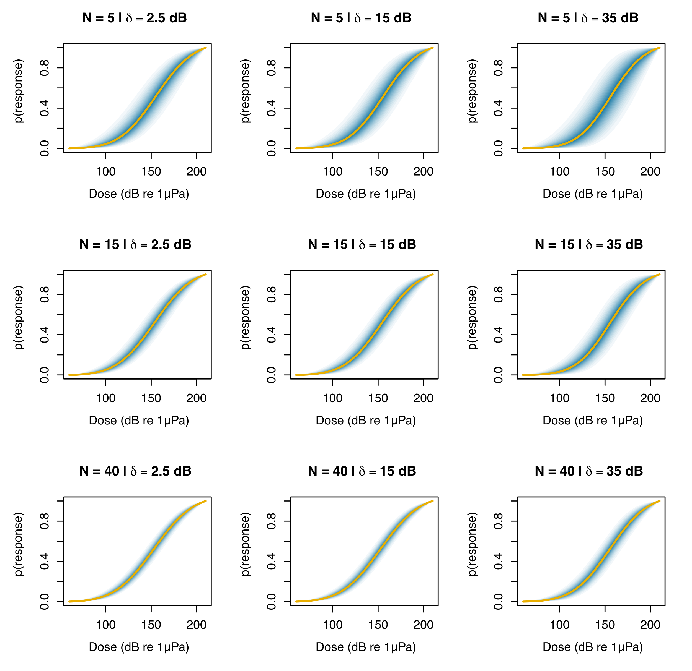

```{r include=FALSE}
#'--------------------------------------------------------------------
# Load required libraries
#'--------------------------------------------------------------------
pacman::p_load(tidyverse, cowplot, knitr, kableExtra, magrittr)
set.seed(75) # Set the random seed
```

\setstretch{1.2}
\section{Preamble}

In this report, we present a framework for simulating responses of cetaceans to various military sonar exposure contexts using Bayesian hierarchical modelling. This work was motivated by the need to assess the utility of different types of animal-attached biotelemetry tags in improving our understanding of dose–response relationships [@Schick2019]. Specifically, we used a Monte Carlo approach to conduct a sensitivity analysis of the effects of uncertainty in acoustic dose measurements (i.e. received sound levels) on the probability of behavioural response. Accompanying R code is available and fully described in a sister document [see @Bouchet2020b for details].

\section{Introduction}

Sound plays a critical role in the lives of cetaceans, and many species of whales, dolphins, and porpoises are sensitive to the adverse effects of chronic and acute exposure to anthropogenic underwater noise [@Williams2015; @Erbe2019; @Weilgart2007]. For instance, elevated noise levels (e.g. in areas of dense vessel traffic) have the potential to impair animal communication ['auditory masking'; @Erbe2016; @Cholewiak2018], disrupt movement and diving behaviours, elicit physiological stress, and/or cause displacements from preferred habitats [@DeRuiter2013], ultimately interfering with key life functions such as foraging, mating, nursing, or resting, with knock-on repercussions on individual fitness, energy expenditure, and survival [@Tyack2008; @Wensveen2019; @Erbe2018]. In recognition of man-made noise as an emerging threat to wildlife, an increasing number of calls have been made to strengthen management and mitigation frameworks for sound-producing activities [@Dolman2015; @Dolman2011]. In the United States, the Marine Mammal Protection Act of 1972 (MMPA, 16 U.S.C. 1361 et seq.) regulates the ‘take’ (i.e. defined as the harassment, hunting, capture, or killing) of marine mammals by U.S.-based organisations anywhere around the globe, including areas beyond national jurisdiction (i.e. on the high seas). The U.S. Navy is legally bound to comply with the MMPA and other U.S. Federal laws (e.g. the Endangered Species Act ESA 16 U.S.C.1531 et seq.) pertaining to protected marine taxa, and is thus required to determine the potential effects of Systems Command military readiness training exercises on cetaceans, especially where those involve the use of tactical high-powered sonar technology and the deployment of explosives/munitions.

Of particular concern are the impulsive sounds produced by active sonars operating in the lower (LFAS, ~0.1-2 kHz) and mid-frequency bands (MFAS, 3–8 kHz) [@Falcone2017]. LFAS and MFAS systems were developed in the 1950s for anti-submarine detection and naval warfare [@Damico2009; @deQuiros2019], and their use has recently been implicated in a number of atypical mass strandings largely involving deep-diving pelagic whales from the *Ziphiidae* family, such as Cuvier's beaked whales (*Ziphius cavirostris*) [@Damico2009b; @Filadelfo2009; @Fernandez2012; @Simonis2020; @Cox2006; see also @Parsons2017 for a recent review]. In the last two decades, recurring reports of such mortality events prompted a series of coordinated international research efforts aimed at quantifying probabilities of response to both simulated and actual naval sonar sources under controlled experimental exposure conditions [@Southall2016; @Harris2016]. These behavioural response studies (BRSs) have catalysed significant advances in our understanding of the short-term impacts of specific acoustic doses on animals [@Harris2016; @Harris2018], highlighting substantial variability in the nature, magnitude, and consequences of observed responses within and between individuals and populations [e.g. @DeRuiter2013; Goldbogen2013; @Friedlaender2016; @Southall2019].

In BRSs, whale behaviour is typically monitored using animal-borne bio-logging tags, with additional information sometimes derived from opportunistic visual observations or passive acoustics [e.g. @Berga2019; @vonBendaBeckmann2019]. The onerous costs of running at-sea BRS experiments, which often exceed many hundreds of thousands of dollars for a single field season [@Harris2016], provide a strong impetus for integrating different sampling approaches to maximise data collection opportunities over a range of complementary spatio-temporal scales. As such, a rising number of studies simultaneously deploy short-term (ca. hours), high-resolution, archival digital tags [DTAGs; @Johnson2003] and medium to long-term (ca. days to months), coarse-resolution, position and depth-transmitting satellite tags [e.g. @Tyack2011; @Wensveen2019; @Schick2019]. Suction cup DTAGS incorporate multiple sensors, including a hydrophone (sampling rate up to 192 kHz), a pressure sensor, triaxial accelerometers and magnetometers, and an embedded VHF transmitter, which enable fine-scale diving behaviour (i.e. orientation, depth, and speed) to be captured in three dimensions synchronously with the recording of audio data [@Tyson2012; @Laplanche2015]. Although DTAGs offer detailed insights into dynamic activity states, their limited sampling duration precludes assessments of long-term baseline behaviours, both prior to and following noise disturbance [@Schick2019]. By contrast, implantable satellite tags allow the animals' horizontal movements to be captured over much wider spatial and temporal domains [@Schorr2014], yet most modern instruments lack on-board hydrophones and therefore cannot obtain direct sound measurements. Furthermore, satellite tags programmed to transmit via the Argos system ([https://www.argos-system.org/](https://www.argos-system.org/)) can suffer from substantial positional errors that may introduce large uncertainties in estimates of acoustic dose (often exceeding 50 dB re 1$\mu$Pa rms in range) [@Schick2019; @vonBendaBeckmann2019].

Such discrepancies in data quality and resolution between the two types of tags raise important questions with regards to the optimisation of field protocols in BRSs [@Harris2018]. To inform optimal choices of tag configurations, we conducted a Bayesian simulation exercise designed to explore how uncertainty in the measurements of received sound levels made on both digital and satellite tags may affect inference of dose–response relationships. Specifically, we simulated behavioural response data from virtual whales exposed to military sonar and fitted with different tags, and investigated the sample sizes and accuracy required to estimate dose–response functions [also referred to as risk functions, @Moretti2014] with an acceptable degree of confidence. The use of computational Bayesian methods for model fitting in ecology has increased in recent decades [@Dorazio2016; @Beaumont2010; @Clark2005]. Here, Bayesian analysis offers a natural mechanism for estimating the parameters of potentially complex hierarchical models within a single framework that is robust to the small sample sizes often encountered in BRS research, and can provide measures of parameter uncertainty that are directly interpretable in probabilistic terms [@Antunes2014; @Parent2012]. This is crucial for making appropriate predictions of responsiveness during real-world naval exercises [@Harris2018].

\section{Original model}

This work expands on the Bayesian hierarchical dose–response model presented by @Miller2014 (Figure \hyperlink{fig1}{1}). We only summarise the model briefly here, and refer the reader to the original publication for full details.

The model assumes that for any sonar exposure session, each individual whale $i$ has a response threshold that is a function of (1) the typical average response threshold of all whales, $\mu$; (2) two contextual covariates (namely, exposure history and frequency of the sonar signal/stimulus), in addition to random between-whale ($\phi^2$) and within-whale, between-session variation ($\sigma^2$). The full model consists of both a **process** model, which describes the underlying factors driving the true thresholds of exposure for each session, and an **observation** model, which links the true thresholds to the observed values, measured with error ($\delta^2$). 

The **process** model is interpreted as follows. Let $t_{ij}$ be the true, unknown threshold of exposure that elicits a behavioural response for the $i_{th}$ whale in the $j_{th}$ exposure session. We assume that this threshold follows a truncated normal distribution such that:

\begin{equation} 
  t_{ij}\sim TN(\mu_{ij}, \sigma^{2},L, U)
  (\#eq:tij)
\end{equation} 

where $\sigma^{2}$ is the within-animal between-session variance in threshold, and $L$ and $U$ are lower and upper limits to the threshold. Let us also assume that the expected threshold $\mu_{ij}$ for the $i_{th}$ whale in the $j_{th}$ exposure session is a function of the expected threshold for that whale, $\mu_{i}$, as well as whether the animal has been previously exposed to sonar, and the frequency band of the sonar signal used. This gives: 

\begin{equation} 
 \mu_{ij}\sim \mu_{i} + \alpha \: I(\text{exposed})_{ij} + \beta \:I(\text{MFAS})_{ij}
  (\#eq:muij)
\end{equation} 

Here, $\alpha$ is a parameter governing the effect of exposure history on threshold, and $I(\text{exposed})_{ij}$ is an indicator function to which a value of 0 is assigned during the first exposure session, and a value of 1 thereafter. Likewise $\beta$ represents the effect of MFAS relative to LFAS, with $I(\text{MFAS})_{ij}$ taking the value 1 if the exposure session was with MFAS, and 0 otherwise. Lastly, we assume that the expected threshold for each whale $\mu_i$ follows a truncated normal distribution: 

\begin{equation} 
 \mu_i \sim TN(\mu, \phi^2, L, U)
  (\#eq:mui)
\end{equation} 

where $\mu$ is the mean threshold for all whales, $\phi$ is the between-whale variance in threshold, and L and U are defined as above.

(ref:captionfig1) **1:** \hypertarget{fig1}{}Bayesian hierarchical dose–response model used by @Miller2014 in their analysis of killer whale (*Orcinus orca*) dose–escalation data. **(A)** Directed acyclic graph showing the model structure. Model variables are denoted by circles, whereas constants are represented by boxes. Variables monitored for posterior inference are shaded in grey. Black and grey arrows indicate stochastic and deterministic relationships, respectively. **(B)** Posterior dose–response curve showing the probability of onset of avoidance against received sound pressure level (SPL, dB re $\mu$Pa), for the same species. The solid central line represents the posterior mean, followed by 50%, 95%, and 99% credible interval lines.  

```{r fig1, echo=FALSE, fig.show='hold', cache = TRUE, out.width = '100%', fig.align='center', fig.cap = "(ref:captionfig1)"}

```

The **observation model** allows the inclusion of uncertainty in simulated threshold values. Here, we assumed that measurements on tags followed a normal distribution i.e. 

\begin{equation} 
 y_{ij} \sim N(t_{ij}, \delta^2)
  (\#eq:mui)
\end{equation} 

Note that @Miller2014 set the standard deviation $\delta$ to 2.5 dB, giving a 95% density interval for the threshold of $\pm$ 5.0 dB around the point estimate.

\section{Simulations}

\subsection{Scenarios}

We considered four scenarios, each a variant of the original @Miller2014 model (Figure \hyperlink{fig2}{2}). Scenarios differed in the nature and complexity of their observation and process model components, as described below. Simulation plans and directed acyclic graphs (DAGs) are reported in Appendix \hyperlink{appendixa}{A} and Appendix \hyperlink{appendixb}{B}), respectively, at the end of this document.

**Scenario 1** is a reduced version of @Miller2014, whereby individuals are exposed to sonar only once and fitted with the same tag type. As such, the within-whale variance, $\phi$, and the between-whale variance, $\sigma$, are combined into a single parameter representing the overall variance in threshold, $\omega$. There are no covariates affecting the probability of response in this scenario. We tested an array of realistic sample sizes, from $N$ = 5 to $N$ = 40, and increasing levels of measurement error from $\delta$ = 2.5 dB re 1$\mu$Pa to 35 dB re 1$\mu$Pa. The lower bound reflects typical errors observed on DTAGs (Isojunno & Wensveen, personal communication), while the upper bound is consistent with estimates from sattelite-tagged whales [@Schick2019; @vonBendaBeckmann2019; @Joyce2020].

(ref:captionfig2) **2:** \hypertarget{fig2}{}Visual summary of the four simulation scenarios considered. The complexity of process and observation model components goes from low (-) to high (+) along each axis, and reflects the inclusion/omission of covariates affecting the response thresholds (process model) and errors in measurements of the dose being treated as constants for all animals or as tag-specific variables. Covariates include exposure history and sonar signal type. Scenario IDs are shown in the central black boxes.

```{r fig2, echo=FALSE, fig.show='hold', cache = TRUE, out.width = '50%', fig.align='center', fig.cap = "(ref:captionfig2)"}

```

**Scenario 2** is identical to the original @Miller2014 model, and was implemented with a range of measurement errors between 2.5 dB re 1$\mu$Pa and 35 dB re 1$\mu$Pa, as in scenario 1. To keep the average expected threshold $\mu_{ij}$ centred in the simulations, we treated signal type as a relative effect between animals exposed to MFAS vs. LFAS, assuming that the former exacerbated sensitivity to sonar exposure. As such, the $\beta$ parameter was coded in as an effect size, such that for $\beta$ = 20 dB re 1$\mu$Pa, the corresponding coefficient values for MFAS and LFAS were -10 and +10 dB re 1$\mu$Pa, respectively.

**Scenario 3** mimicks scenario 1, but includes a more complex observation model that accommodates tag-specific measurement errors. Indeed, the positions of tagged individuals are recorded with varying precision — typically higher for animals fitted with DTAGs that are also concurrently followed by visual observers at the surface, and far lower for satellite-tagged animals monitored through the Argos system [@Costa2010]. Argos relies on the Doppler shift between a polar-orbiting satellite and the animal to communicate positional information [@Schick2019]. For tagged individuals to be detected and geolocalised, a sufficient number of satellites must be available when animals are at the surface. This presents a significant challenge for deep-diving cetaceans such as beaked whales, which only come up to breathe for short periods of time, thus reducing the likelihood of successful data uplinks to overhead receivers. In practice, observations are still recorded with uncertainty, even when links are successful [@Schick2019]. Prior to 2008, each position was assigned an ordinal location quality code (e.g., 3, 2, 1, 0, A, B, and Z), with typically substantially higher errors in longitude than in latitude [@Vincent2002], such that true errors around calculated positions are better represented by 2-dimensional anisotropic ellipses than by 1-dimensional circles [@McClintock2015]. Following 2008, Argos has therefore been supplying error ellipses with each location, whereby each ellipse has three components — namely its semi-major axis ($M$), semi-minor axis ($m$), and orientation ($c$). Taken together, these define a bivariate normal distribution of geolocation error, with larger ellipses being associated with higher positional uncertainty [@McClintock2015]. Accounting for this uncertainty is critical in making fair assessments of variance in received levels, and thus in quantifying dose–response relationships effectively [@Schick2019]. To address this, we first estimated the coordinates of each virtual whale on the $(x,y)$ plane at the time of exposure, based on its simulated true response threshold $t_{ij}$ and a simple inverse-square circular transmission loss model (Figure \hyperlink{fig3}{3}). Note that sound absorption is frequency-dependent, and here, we assumed an absorption coefficient of 0.185 dB re 1 $\mu$Pa per km, which corresponds to a 3 kHz signal under normal sea conditions [@Miller2014]. Coordinates were obtained relative to the noise source, using a random angle sampled from a uniform distribution $U(0, 360)$. Next, we created one plausible realisation of an Argos ellipse for each animal by randomly sampling a vector of ellipse parameters $\theta_{ij} = (M_{ij}, m_{ij}, c_{ij})$ from an existing dataset on tagged Cuvier's beaked whales (*Ziphius cavirostris*) collected as part of the Atlantic BRS [@Schick2019]. We then generated 10,000 candidate locations within this ellipse, and calculated the acoustic dose received at each of these locations based on the aforementioned transmission loss model. We took the standard deviation of the resulting values as a reasonable estimate of the measurement uncertainty associated with each satellite-tagged whale. Note that the Atlantic BRS also targeted short-finned pilot whales (*Globicephala macrorhynchus*). Given the unique diving behaviours of each species, the R code has been set up so that the above calculations can be run on either [see the argument $\text{species.argos}$ in the function $\text{run.scenario()}$; @Bouchet2020b]. By contrast, we fixed $\delta$ to a constant value of 2.5 dB re 1 $\mu$Pa for whales fitted with DTAGs, as the accuracy of these instruments is unlikely to vary appreciably. At each sample size, animals were randomly chosen and fitted with either type of tag, according to a pre-determined ratio (digital vs. satellite) which we varied from 0% to 100% in 20% increments (\hyperlink{appendixa}{Appendix A}).

**Scenario 4** merges scenarios 2 and 3 insofar as individuals are repeatedly exposed and fitted with different types of tags. Here, response thresholds are also dependent on signal type (MFAS vs LFAS) and exposure history.

(ref:captionfig3) **3:** \hypertarget{fig3}{}Visual summary of the approach taken to estimate uncertainty in received levels after accounting for positional errors inherent to Argos-linked satellite tags.

```{r echo=FALSE, fig.show='hold', fig.align='center', out.width='100%', fig.cap = "(ref:captionfig3)"}

```

\subsection{Data and parameters}

Table \hyperlink{tab1}{1} below provides a summary of simulation inputs and parameter values. 

In brief, the simulated data were generated so as to reflect the number of trials, sonar frequencies, and orders of exposures observed in real-world BRSs [@Miller2014]. We focused on Cuvier's beaked whales (*Ziphius cavirostris*) as a model species, considering a single exposure session in scenarios 1 and 3 and three repeated trials in scenarios 2 and 4. The source level of the sonar signal was held constant at 210 dB re 1 $\mu$Pa in all simulations [@Antunes2014; @Stimpert2014; @DeRuiter2013; @Tyack2011]. The true underlying mean response threshold (for all whales) was taken as $\mu$ = 150 dB re 1 $\mu$Pa based on @Moretti2014, and is also broadly consistent with the values used in @Miller2014, @Schick2019, and other studies. By default, between-animal and within-animal, between-session variation were set to $\phi$ = 20 dB re 1 $\mu$Pa and $\sigma$ = 25 dB re 1 $\mu$Pa, respectively. As variances add, the overall combined variation $\omega$ was equal to $\sqrt{{\phi}^2 + {\sigma}^2}\approx$ 30 dB re 1 $\mu$Pa.

It is common for some individuals to exhibit no response across the range of doses experienced during an escalation session [@Harris2015; @Antunes2014]. The resulting data are right-censored, and indicate that the animals' response thresholds exceed the maximum dose received by some unknown amount [@Klein2003]. It is critical to include these data in any analysis, as they are informative about the nature of dose–response relationships [@Harris2015]. Note, however, that there is limited empirical evidence of behavioural effects at very high sound levels nearing 200 dB re 1$\mu$Pa (or above), and that the value used as an upper boundary for right-censoring may have an overwhelming influence on posterior inference if not chosen appropriately [@Wensveen2016]. Here, we simulated right-censoring by making a random draw from a uniform distribution $R_c \sim U(190, 200)$ for each exposed animal [@Antunes2014; @Tyack2011; @DeRuiter2013; @Stimpert2014]. In practice, if the simulated response threshold for an animal (i.e. $\mu_i$ in scenarios 1 and 3, and $t_{ij}$ in scenarios 3 and 4; see \hyperlink{appendixb}{Appendix B}) was greater than the associated realised maximum dose $Rc$, then that threshold was assumed to be equally likely between $Rc$ and the upper limit $U$ (set equal to the source level, as all whales would be expected to respond if located right over the source).

Note that, for simplicity, we did not implement Gibbs Variable Selection (GVS) [@Tenan2014; @Miller2014]. Rather, in scenarios 2 and 4, we assessed the ability of the models to discriminate covariate effects by examining the posterior distributions of the relevant coefficients, $\alpha$ and $\beta$. If the corresponding 95% credible intervals included zero, then we deemed the model unable to detect an effect.

**Table 1:** \hypertarget{tab1}{}Parameter values used in bayesian simulations. The last two parameters (i.e. animal density and number of bins) relate to the effective response range. See section \hyperlink{section45}{4.5} for details.

\renewcommand{\arraystretch}{1.5}
```{r tab1, echo = FALSE, cache = TRUE}
  tibble::tibble(Parameter = c("Ns", "N", "Nt", "$\\delta$", "P(SAT)", "DTAG.sd", "SL", "Sp", "$\\mu$", "$\\omega$", "$\\phi$", "$\\sigma$", "$\\alpha$", "$\\beta$", "Rc", "D", "Nb"),
                 Definition = c("Number of simulations",
                                "Sample size (number of whales)",
                                "Number of trials (exposure sessions)",
                                "Uncertainty (sd) in dose measurements",
                                "Proportion of whales fitted with satellite tags",
                                "Uncertainty (sd) in dose measurements on DTAGs",
                                "Level of the noise source","Study species",
                                "Mean response threshold for all whales",
                                "Combined variation in threshold (sd)",
                                "Between-whale variation (sd)",
                                "Within-whale, between-session variation (sd)",
                                "Effect of exposure history on response threshold",
                                "Effect of MFAS vs. LFAS on response threshold",
                                "Right-truncation limit (right-censored data)",
                                "Animal density",
                                "Number of bins used to calculate the ERR"),
                 Value = c(500, "5, ..., 40", 3, "2.5, ..., 35", "0, ..., 100",2.5, 210, "Z. cavirostris", 150, 30, 20, 25, 8, 20, "190 to 200", 1, 500),
                 Unit = c("", "", "", "dB", "\\%", "dB", "dB", "","dB", "dB", "dB", "dB", "dB", "dB", "dB", "Animal/km\\textsuperscript{2}", ""),
                 Scenario = c("All", "All", "2 + 4", "1 + 2", "3 + 4", "3 + 4", "All", "All", "All", "1 + 3", "2 + 4", "2 + 4", "2 + 4", "2 + 4", "All", "All", "All")) %>% 
  knitr::kable(., format = "latex", booktabs = TRUE, align = rep('l', ncol(.)), linesep = "", escape = FALSE) %>% 
  kableExtra::kable_styling(latex_options = "striped") %>% 
  kableExtra::row_spec(row = 0, bold = TRUE)
```

\subsection{Priors}

Prior distributions are required on all top-level random variables in the hierarchical model [@Laplanche2015] (shown as grey circles in Figure \hyperlink{fig1}{1}). We followed @Miller2014 and largely chose diffuse uniform priors (Table \hyperlink{tab2}{2}), with the exception of the two coefficients governing the respective effects of exposure history ($\alpha$) and sonar frequency band ($\beta$), for which we assumed normal distributions centred on zero. Note that this choice equates to a prior belief of no effect. Our expectation therefore was that as sample size would increase and errors decrease, posterior estimates of $\alpha$ and $\beta$ would move away from zero and closer to the truth, and that their associated credible intervals would shrink. Importantly, priors were specified so as to constrain model parameters within biologically plausible bounds. For instance, $\mu$ could take any value between 60 and 210 dB re 1$\mu$Pa with equal probability, under the conservative assumption that any noise below the lower limit would be barely audible above ambient [@Schick2019; @Pacini2011], and that all animals would respond at or above the upper limit [@Antunes2014; @Miller2014]. Variance parameters for the observation model were assumed known, and hence did not require priors.

**Table 2:** \hypertarget{tab2}{}Summary of prior values for each parameter, expressed in dB re 1 $\mu$Pa. Lower and upper limits are reported for uniform distributions (U), and mean and standard deviations are reported for normal distributions (N). True underlying values are shown in the right-most column.

\renewcommand{\arraystretch}{1.1}
```{r tab2, echo = FALSE, cache = TRUE}
  tibble::tibble(Scenario = c("All", "1 + 3", "2 + 4", "2 + 4", "2 + 4", "2 + 4"),
                 Variable = c("$\\mu$", "$\\omega$", "$\\phi$", "$\\sigma$", "$\\alpha$", "$\\beta$"),
                 Prior = c("U(60, 200)", "U(0, 40)", "U(0, 30)", "U(0, 30)", "N(0, 10)", "N(0, 10)")) %>% 
  knitr::kable(., format = "latex", booktabs = TRUE, align = rep('c', ncol(.)), linesep = "", escape = FALSE) %>% 
  kableExtra::kable_styling(latex_options = "striped") %>% 
  kableExtra::row_spec(row = 0, bold = TRUE)
```

\subsection{Model fitting}

Models were fitted using a Markov Chain Monte Carlo (MCMC) algorithm, implemented in the software JAGS via the [rjags](https://cran.r-project.org/web/packages/rjags/index.html) library [@Plummer2019] in R v3.6.0 [@RDev2019]. Model parameters were estimated based on 10,000 posterior samples, taken after a variable burn-in (i.e. as the number of samples required to achieve convergence differed between scenarios and simulation conditions; see Table \hyperlink{tab3}{3}). Each parameter was initialised using arbitrary starting values. In all models, MCMC runs consisted of three Markov chains, which were assessed for convergence using functions from the [coda](https://cran.r-project.org/web/packages/coda/index.html) [@Plummer2019b] and [bayesplot](https://mc-stan.org/bayesplot/) [@Gabry2019] packages. This was done both by visual inspection of trace plots, and by ensuring that the scale reduction factor, or Gelman-Rubin statistic ($\hat{R}$), was < 1.1 [@Kruschke2010]. We fitted models to 500 simulated datasets, running the R code in parallel on multiple cores to increase execution speed [@Bouchet2020b].

**Table 3:** \hypertarget{tab3}{}Number of Markov Chain Monte Carlo (MCMC) iterations discarded as initial burn-in in each scenario. $\delta$ = Uncertainty in measurements of the acoustic dose (sd, in dB re 1$\mu$Pa). P(SAT) = Proportion of animals fitted with satellite tags (in %).

\renewcommand{\arraystretch}{1.1}
```{r tab3, echo = FALSE, cache = TRUE}
b1 <- c(10000, 10000, 40000, 75000, 75000, 100000, 100000, 100000)
b2 <- b1 + 50000
b3 <- c(50000, 50000, 75000, 75000, 125000, 125000)
b4 <- b3 + 50000

tibble::tibble("$\\delta$" = c(c(2.5, 5, 10, 15, 20, 25, 30, 35), rep("-",6)),
               "P(SAT)" = c(rep("-", 8), c(0,20,40,60,80,100)),
               "1" = c(format(b1, big.mark = ","), rep("-", 6)),
               "2" = c(format(b2, big.mark = ","), rep("-", 6)),
               "3" = c(rep("-", 8), format(b3, big.mark = ",")),
               "4" = c(rep("-", 8), format(b4, big.mark = ",")))  %>% 
  knitr::kable(., format = "latex", booktabs = TRUE, align = rep('c', ncol(.)), linesep = "", escape = FALSE,
               format.args = list(big.mark = ',')) %>% 
  kableExtra::kable_styling(latex_options = "striped") %>% 
  kableExtra::add_header_above(c(" " = 2, "Scenarios" = 4))
```

\subsection{Model outputs}
\hypertarget{section45}{}

Reliable assessments of sonar impacts cannot be made without knowledge of animal density patterns and sound transmission properties, for a given exposure context. In particular, single-value step function thresholds commonly used in 'traditional' impact assessments have been shown to grossly underestimate the numbers of animals affected by a given sound disturbance [@Tyack2019]. Because of this, we calculated the effective response range (or effective response radius, ERR) from the posterior estimates of model parameters in each simulation. Drawing from concepts rooted in distance sampling theory, the ERR is a novel metric of impact defined as the distance beyond which as many animals are expected to respond as do not respond within it [see @Tyack2019 for a technical explanation]. We assumed the same simple inverse-square circular transmission loss model as previously described, and performed calculations within 500 bins placed over a maximum range given by the distance at which received levels drop below 60 dB re 1$\mu$Pa (i.e. such that the probability of response is effectively zero), which in this case equalled ca. 240 km.

We compared the posterior distributions of $\mu$, $\omega$, $\phi$, $\sigma$, $\alpha$, $\beta$ and the ERR with their 'true' underlying values, focusing on three key diagnostics: **(1) precision**, expressed as the average width of the parameters' posterior credible intervals (CIw, in dB re 1$\mu$Pa or km); **(2) accuracy**, measured as the average absolute percent mean bias (PMB, in %); and **(3) identifiability**, as captured by the average prior posterior overlap (PPO), obtained using the [MCMCtrace](https://www.rdocumentation.org/packages/MCMCvis/versions/0.7.1/topics/MCMCtrace) function in package [MCMCvis](https://cran.r-project.org/web/packages/MCMCvis/index.html) [@Youngflesh2018]. Checking the PPO is useful for identifying parameter-redundant models, i.e. models in which the prior for a parameter simply dictates its posterior distribution, and the data have little if any bearing on the results. A 35% guideline for overlap has been suggested as an indicator of weak parameter identifiability, meaning that when PPO < 35%, the data may be informative enough to overcome the influence of the prior [@Gimenez2009]. Note that, as a derived quantity, the ERR has no prior and therefore no PPO.

Lastly, we also computed dose–response curves from each model in the same way as @Miller2014, and created plots of the associated posterior median and posterior credible interval lines for a range of chosen quantiles (from 5% to 95%, in 5% increments).

\section{Results}

For both clarity and brevity, only key results are presented below. The full set of dose–response curves and summary plots for each scenario is available from the authors upon request.

\subsection{Scenario 1}
\hypertarget{section51}{}

Dose–response curves indicated a strong interaction between sample size ($N$) and measurement errors ($\delta$) in this scenario (Figure \hyperlink{fig4}{4}), with the uncertainty around estimated relationships rapidly inflating as $N$ decreased and $\delta$ increased. All else being equal, changes in posterior uncertainty were more pronounced at the lowest sample sizes. The curves obtained for sample sizes of $N$ = 5 to 10 and $\delta$ = 15 to 20 dB re 1$\mu$Pa were qualitatively similar to the one derived by @Miller2014 for killer whales (*Orcinus orca*). The model appeared able to estimate $\mu$ with negligible bias, however $\omega$ was consistently under-estimated when sample sizes were low and errors high, a pattern mirrored in estimates of the ERR (Figures \hyperlink{fig5}{5} and \hyperlink{fig6}{6}). For a given sample size, precision increased (up to two-fold) for all parameters as errors were lowered to a level commensurate with that of DTAGs ($\delta$ = 2.5 dB re 1$\mu$Pa). $\mu$ was found to be identifiable (PPO < 35%) in all but the most extreme conditions (i.e. lowest $N$ and highest $\delta$), highlighting the relevance of the information contained in the simulated data for predicting the population-level threshold of response. However, considerable overlap between prior and posterior was observed for $\omega$, particularly when $N$ < 15 (irrespective of the level of measurement error) (Figure \hyperlink{fig6}{6}).

(ref:captionfig4) **4:** \hypertarget{fig4}{}Example dose–response curves estimated under scenario 1 for a range of sample sizes (N) and errors in dose measurements ($\delta$). The solid line represents the average posterior median across Ns = 500 simulations, followed by the average 5%, 10%, 15% ... and 95% credible intervals in darker to lighter shades of blue.

```{r echo=FALSE, fig.show='hold', fig.align='center', out.width='100%', fig.cap = "(ref:captionfig4)"}

```

(ref:captionfig5) **5:** \hypertarget{fig5}{}Summary of posterior inference for key model parameters under scenario 1. Circles and bars denote, respectively, the average posterior median and average posterior credible intervals across Ns = 500 simulations, for combinations of sample sizes (N) and observation errors ($\delta$, standard deviation in measurements of the acoustic dose). Parameters are as follows: **(A)** mean response threshold for all whales, $\mu$, **(B)** overall (between and within-whale) variation in response threshold, $\omega$, and **(C)** effective response range (ERR). X-axis scales are expressed in dB re 1$\mu$Pa (A,B) and km (C), respectively. Dashed lines represent true underlying values for each parameter.

```{r echo=FALSE, fig.show='hold', fig.align='center', out.width='100%', fig.cap = "(ref:captionfig5)"}

```

(ref:captionfig6) **6:** \hypertarget{fig6}{}Precision, accuracy, and identifiability of posterior estimates of the mean response threshold for all whales ($\mu$) **(top)**, the combined (between-whale and within-whale) variation in threshold ($\omega$) **(middle)**, and the effective response range (ERR) **(bottom)**, under scenario 1. Columns show **(A)** the average width of credible intervals (CIw) across simulations, expressed in dB re 1$\mu$Pa for $\mu$ and $\omega$ and in km for ERR, **(B)** the average absolute percent mean bias (PMB, in %), defined as (posterior mean-truth)/truth, and **(C)** the prior posterior overlap (PPO, in %). PPO values above 35% indicate that parameters may be non-identifiable [@Gimenez2009].

```{r echo=FALSE, fig.show='hold', fig.align='center', out.width='90%', fig.cap = "(ref:captionfig6)"}

```

\subsection{Scenario 2}
\hypertarget{section52}{}

Similarly to scenario 1, an interaction between sample size ($N$) and measurement errors ($\delta$) was apparent in this case (Figure \hyperlink{fig7}{7}), with larger uncertainty in estimated relationships with decreasing $N$ and increasing $\delta$. The model was able to estimate $\phi$ with negligible bias across most samples sizes, as well as $\beta$ when the number of simulated whales exceeded $N$ = 20. All other posterior parameter estimates deviated from their true underlying values to varying degrees, with larger bias consistently observed in simulations with high measurement errors. Again, the effective response range (ERR) was under-estimated in all but the best simulation conditions (i.e. high sample sizes and low errors) (Figures \hyperlink{fig8}{8} & \hyperlink{fig9}{9}). The model was unable to detect an effect of previous exposure history on expected response thresholds ($\alpha$), however the simulated effect of sonar signal frequency ($\beta$) was successfully identified in all runs at $N$ = 40, and when measurement errors were limited to a maximum of SD = 15 and 5 dB re 1$\mu$Pa at $N$ = 20 and $N$ = 15, respectively. This aligns with observations of high overlap (>35%) between prior and posterior for $\alpha$, whereas $\beta$ was identifiable in more than half of test conditions (Figure \hyperlink{fig9}{9}).

\subsection{Scenario 3}

Sample size was found to be the main driver of variability around estimated dose–response relationships in this scenario, such that curves remained virtually identical as the ratio of digital vs. satellite tags changed, but became more uncertain as $N$ decreased (Figure \hyperlink{fig10}{10}). Accordingly, credible intervals for all parameters were large with small datasets (e.g. $N$ = 5), and gradually decreased as a higher number of virtual whales were tagged (Figure \hyperlink{fig11}{11}). Losses in accuracy, precision, and identifiability with decreasing $N$ were more pronounced than in scenario 1 (with an equivalent underlying process model) (Figure \hyperlink{fig12}{12}). $\mu$ was always identifiable (PPO < 35%), and $\omega$ consistently so for $N$ > 15.

\subsection{Scenario 4}

Consistent with scenario 3 (i.e. where the same observation model was used), dose–response curves remained largely similar for a given sample size, irrespective of the number of satellite tags deployed (Figure \hyperlink{fig13}{13}). Credible intervals for all parameters were large with small datasets (e.g. $N$ = 5), and decreased as a higher number of virtual whales were tagged (Figure \hyperlink{fig14}{14}). No effect of previous exposure history could be identified (i.e. the posterior credible intervals for $\alpha$ always included zero), yet the influence of sonar frequency ($\beta$) could be detected with sample sizes as low at $N$ = 15, in line with $\beta$ being identifiable in two thirds of test conditions (Figure \hyperlink{fig15}{15}). The effective response range (ERR) was estimated with limited bias, and with lowest uncertainty at highest sample sizes.

Note that in the previous two scenarios, we emulated the deployment of digital and satellite tags by modifying the level of measurement error ($\delta$) allowed in the observation model. This was done by treating $\delta$ as a constant for all whales regardless of exposure, with low $\delta$ values (e.g. 2.5 dB re1$\mu$Pa) taken to be representative of the uncertainty associated with DTAGs, and high values corresponding to uplinks of consistently poor quality (i.e. high geolocational error) from satellite tags (e.g. 35 dB re1$\mu$Pa). Under these conditions, measurement uncertainty played a strong role in dictating dose–response relationships (see sections \hyperlink{section51}{5.1} and \hyperlink{section52}{5.2}). This is an extereme case, however, as positional estimates derived from satellite tags vary in quality, meaning that some measurements of the acoustic dose experienced by satellite-tagged animals can still be made with reasonable precision (Figure \hyperlink{fig16}{16}). Here, the dominant influence of sample size over tag choice in scenarios 3 and 4 can be explained by the limited range of variation in received levels estimated from satellite tags under real-world settings, conditional on the sound propagation model described previously (average 25%, 50% and 75% quantiles of SD(dose) = 8.3, 11.6, and 20.2 dB re1$\mu$Pa respectively).


(ref:captionfig10) **10:** \hypertarget{fig10}{}Example dose–response curves estimated under scenario 3 for a range of sample sizes ($N$) and proportions of animals fitted with satellite tags (P(SAT)). The solid line represents the average posterior median across Ns = 500 simulations, followed by the average 5%, 10%, 15% ... and 95% credible intervals in darker to lighter shades of blue.

(ref:captionfig7) **7:** \hypertarget{fig7}{}Example dose–response curves estimated under scenario 2 for a range of sample sizes (N) and errors in dose measurements ($\delta$). The solid line represents the average posterior median across Ns = 500 simulations, followed by the average 5%, 10%, 15% ... and 95% credible intervals in darker to lighter shades of blue.

```{r echo=FALSE, fig.show='hold', fig.align='center', out.width='100%', fig.cap = "(ref:captionfig7)"}

```


(ref:captionfig8) **8:** \hypertarget{fig8}{}Summary of posterior inference for key model parameters under scenario 2. Circles and bars denote, respectively, the average posterior median and average posterior credible intervals across Ns = 500 simulations, for combinations of sample sizes (N) and observation errors ($\delta$, standard deviation in measurements of the acoustic dose). Parameters are as follows: **(A)** effect of exposure history on response threshold, $\alpha$, **(B)** effect of sonar frequency on response threshold, $\beta$, **(C)** mean response threshold for all whales, $\mu$, **(D)**  between-whale variance in response threshold, $\phi$, **(E)** within-whale, between-session variance in response threshold, $\sigma$, and **(F)** effective response range (ERR). X-axis scales are expressed in dB re 1$\mu$Pa (A to E) and km (F), respectively. Dashed lines represent true underlying values for each parameter.

```{r echo=FALSE, fig.show='hold', fig.align='center', out.width='105%', fig.cap = "(ref:captionfig8)"}

```

(ref:captionfig9) **9:** \hypertarget{fig9}{}Precision, accuracy, and identifiability of posterior estimates of the effect of exposure history ($\alpha$) **(top)**, the effect of sonar frequency ($\beta$) **(middle)**, and the effective response range (ERR) **(bottom)**, under scenario 2. Columns show **(A)** the average width of credible intervals (CIw) across simulations, expressed in dB re 1$\mu$Pa for $\alpha$ and $\beta$ and in km for ERR, **(B)** the average absolute percent mean bias (PMB, in %), defined as (posterior mean-truth)/truth, and **(C)** the prior posterior overlap (PPO, in %). PPO values above 35% indicate that parameters may be non-identifiable [@Gimenez2009].

```{r echo=FALSE, fig.show='hold', fig.align='center', out.width='90%', fig.cap = "(ref:captionfig9)"}
knitr::include_graphics("fig/fig_heatplot_S2.png")
```


```{r echo=FALSE, fig.show='hold', fig.align='center', out.width='100%', fig.cap = "(ref:captionfig10)"}

```

(ref:captionfig11) **11:** \hypertarget{fig11}{}Summary of posterior inference for key model parameters under scenario 3. Circles and bars denote, respectively, the average posterior median and average posterior credible intervals across Ns = 500 simulations, for combinations of sample sizes (N) and proportions of animals fitted with satellite tags (P(SAT), in %). Parameters are as follows: **(A)** mean response threshold for all whales, $\mu$, **(B)** overall (between and within-whale) variation in response threshold, $\omega$, and **(C)** effective response range (ERR). X-axis scales are expressed in dB re 1$\mu$Pa (A,B) and km (C), respectively. Dashed lines represent true underlying values for each parameter.

```{r echo=FALSE, fig.show='hold', fig.align='center', out.width='105%', fig.cap = "(ref:captionfig11)"}

```

(ref:captionfig12) **12:** \hypertarget{fig12}{}Precision, accuracy, and identifiability of posterior estimates of the mean response threshold for all whales ($\mu$) **(top)**, the combined (between-whale and within-whale) variation in threshold ($\omega$) **(middle)**, and the effective response range (ERR) **(bottom)**, under scenario 3. Columns show **(A)** the average width of credible intervals (CIw) across simulations, expressed in dB re 1$\mu$Pa for $\mu$ and $\omega$ and in km for ERR, **(B)** the average absolute percent mean bias (PMB, in %), defined as (posterior mean-truth)/truth, and **(C)** the prior posterior overlap (PPO, in %). PPO values above 35% indicate that parameters may be non-identifiable [@Gimenez2009].

```{r echo=FALSE, fig.show='hold', fig.align='center', out.width='90%', fig.cap = "(ref:captionfig12)"}

```

(ref:captionfig13) **13:** \hypertarget{fig13}{}Example dose–response curves estimated under scenario 4 for a range of sample sizes ($N$) and proportions of animals fitted with satellite tags (P(SAT)). The solid line represents the average posterior median across Ns = 500 simulations, followed by the average 5%, 10%, 15% ... and 95% credible intervals in darker to lighter shades of blue.

```{r echo=FALSE, fig.show='hold', fig.align='center', out.width='100%', fig.cap = "(ref:captionfig13)"}

```

(ref:captionfig14) **14:** \hypertarget{fig14}{}Summary of posterior inference for key model parameters under scenario 4. Circles and bars denote, respectively, the average posterior median and average posterior credible intervals across Ns = 500 simulations, for combinations of sample sizes (N) and proportions of animals fitted with satellite tags (P(SAT), in %). Parameters are as follows: **(A)** effect of exposure history on response threshold, $\alpha$, **(B)** effect of sonar frequency on response threshold, $\beta$, **(C)** mean response threshold for all whales, $\mu$, **(D)**  between-whale variance in response threshold, $\phi$, **(E)** within-whale, between-session variance in response threshold, $\sigma$, and **(F)** effective response range (ERR). X-axis scales are expressed in dB re 1$\mu$Pa (A to E) and km (F), respectively. Dashed lines represent true underlying values for each parameter.

```{r echo=FALSE, fig.show='hold', fig.align='center', out.width='90%', fig.cap = "(ref:captionfig14)"}

```

(ref:captionfig15) **15:** \hypertarget{fig15}{}Precision, accuracy, and identifiability of posterior estimates of the effect of exposure history ($\alpha$) **(top)**, the effect of sonar frequency ($\beta$) **(middle)**, and the effective response range (ERR) **(bottom)**, under scenario 4. Columns show **(A)** the average width of credible intervals (CIw) across simulations, expressed in dB re 1$\mu$Pa for $\mu$ and $\omega$ and in km for ERR, **(B)** the average absolute percent mean bias (PMB, in %), defined as (posterior mean-truth)/truth, and **(C)** the prior posterior overlap (PPO, in %). PPO values above 35% indicate that parameters may be non-identifiable [@Gimenez2009].

```{r echo=FALSE, fig.show='hold', fig.align='center', out.width='90%', fig.cap = "(ref:captionfig15)"}

```

(ref:captionfig16) **16:** \hypertarget{fig16}{}Variation in the estimated acoustic dose experienced by 2,000 simulated animals fitted with Argos-linked satellite tags at incremental distances from the sonar noise source. Values are expressed as the standard deviation (SD) in received levels across 10,000 candidate locations sampled within a plausible error ellipse around each individual, assuming an inverse-square circular transmission loss model (see Figure \hyperlink{fig3}{3} for details).

```{r echo=FALSE, fig.show='hold', fig.align='center', out.width='90%', fig.cap = "(ref:captionfig16)"}
knitr::include_graphics("fig/fig_argos_sd.pdf")
```


\section{Key messages}

* The diagrams presented herein facilitate direct comparisons of experimental conditions (i.e. combinations of $N$ x $\delta$ and $N$ x P(SAT)), such that questions surrounding the optimisation of field protocols in BRSs can be readily answered.
* For instance, a similar level of confidence in estimates of the effective response range can be obtained from a sample of $N$ = 10 whales with low measurement errors ($\delta$ = 2.5 dB re 1$\mu$Pa, emulating the deployment of DTAGs) as from a sample of $N$ = 40 whales with high measurement errors ($\delta$ = 35 dB re 1$\mu$Pa, emulating satellite tags with consistently poor uplinks) (scenario 1).
* The larger the sample size, the larger the observation error (or the proportion of satellite tags) that is permissible to make inference of dose–response relationships with a desired level of certainty.
* Similar patterns of decreased precision, accuracy, and identifiability at smaller sample sizes and larger errors are observed across scenarios.
* The variance in response threshold is consistently more difficult to estimate than the mean, with posterior distributions undifferentiable from their associated priors in many cases. 
* Conditional on the use of a circulation sound propagation model, substantial improvements to estimates of variance can however be obtained with larger sample sizes. This is critical, as these parameters are key to determining dose–response relationships and therefore quantifying impact. 
* When the observation model allows for tag-specific measurement errors (scenarios 3 and 4), sample size becomes the main driver of uncertainty in dose–response relationships, as satellite tags still allow measurements of received levels with relatively high precision.
* The effect of exposure history on expected response thresholds was seldom detected, whereas that of sonar frequency could be correctly identified in most cases when $N$ > 15.
* The data presented in this report reflect the specific parameter values used in the simulations. Although these were chosen to be as representative of current BRSs as possible, it is important that users consider these results in light of their own study designs and experimental needs.

\section{Conclusion}

We demonstrated substantial improvements in the ability to estimate dose–response relationships and disturbance impacts at larger sample sizes, largely independently of the types/combinations of biotelemetry tags deployed on simulated whales. Despite heterogeneous measurement error, this suggests that previous efforts at deploying satellite tags have been valuable at furthering our understanding of cetacean responses to sonar, and should be pursued into the future.

\section{Future work}

A draft manuscript summarising the results of this work is currently being prepared for publication.

Bouchet PJ, Harris CM, Thomas L. (In prep). Optimising tagging programmes for understanding cetacean responses to military sonar exposure. Target journal: **Biology Letters** ([https://royalsocietypublishing.org/journal/rsbl](https://royalsocietypublishing.org/journal/rsbl)).

\section{Acknowledgements}

The research reported here was financially supported by the US Navy Living Marine Resources Programme (LMR) Contract No. N3943018C2080. We thank Rob Shick and the Atlantic BRS project for providing the Argos ellipse data required in scenarios 3 and 4. Support for that project is provided by Naval Facilities Engineering Command Atlantic under Contract No. N62470-15-D-8006, Task Order 18F4036, Issued to HDR, Inc. 

\section{Data availability}

The R code used in the analyses is fully described and available at: https://github.com/pjbouchet/doublemocha_sim

\section{References}

<div id="refs"></div>

\pagebreak

# (APPENDIX) Appendix {-}

# Appendix A -- Simulation plans
\hypertarget{appendixa}{}

Tabular summaries of the simulation plans for each scenario are given below. **sim:** Unique simulation identification number. **N:** Sample size (number of animals). **Ns:** Number of simulations. **N(DTAG):** Number of animals fitted with digital tags. **N(SAT):** Number of animals fitted with Argos satellite tags. **P(SAT):** Proportion of animals fitted with Argos satellite tags. See Table \hyperlink{tab1}{1} for details on model parameters.

```{r include=FALSE}
# Parameters
sample.sizes <- c(5, 10, 15, 20, 40)
uncertainty.dose <- c(2.5, 5, 10, 15, 20, 25, 30, 35) # dB
true.mu <- 165; true.omega <- 30; true.phi <- 20; # dB
true.sigma <- 25; true.beta <- 20; true.alpha <- 8 # dB
Nsim <- 500
```

\subsection{Scenario 1}

```{r echo=FALSE, cache = TRUE}
sc1 <- expand.grid(n.whales = sample.sizes, mu = true.mu, omega = true.omega, delta = uncertainty.dose) %>% 
  tibble::as_tibble(.)

sc1 %>% dplyr::arrange(n.whales, delta) %>% 
  dplyr::mutate(sim = 1:nrow(.)) %>% 
  dplyr::select(sim, n.whales, mu, omega, delta) %>% 
  dplyr::mutate(Covariates = "None", Ns = Nsim) %>% 
  knitr::kable(., format = "latex", booktabs = TRUE, align = rep('c', ncol(.)), linesep = "", 
               col.names = c("sim", "N", "$\\mu$", "$\\omega$", "$\\delta$", "Covariates", "Ns"), escape = FALSE) %>%
  kableExtra::kable_styling(latex_options = "striped", font_size = 8) %>% 
  kableExtra::row_spec(row = 0, bold = TRUE)
```

\subsection{Scenario 2}

```{r echo=FALSE, cache = TRUE}
sc2 <- expand.grid(n.whales = sample.sizes, mu = true.mu, phi = true.phi, sigma = true.sigma, delta = uncertainty.dose) %>% 
  tibble::as_tibble(.) 

sc2 %>% dplyr::arrange(n.whales, delta) %>% 
  dplyr::mutate(sim = nrow(sc1)+(1:nrow(.)), beta = true.beta, alpha = true.alpha) %>% 
  dplyr::select(sim, n.whales, mu, phi, sigma, delta, beta, alpha) %>% 
  dplyr::mutate(Covariates = "Frequency + exposure", Ns = Nsim) %>% 
  knitr::kable(., format = "latex", booktabs = TRUE, align = rep('c', ncol(.)), linesep = "",
               col.names = c("sim", "N", "$\\mu$", "$\\phi$", "$\\sigma$", "$\\delta$", "$\\beta$", "$\\alpha$", "Covariates", "Ns"), escape = FALSE) %>%
  kableExtra::kable_styling(latex_options = "striped") %>% 
  kableExtra::row_spec(row = 0, bold = TRUE)
```


\subsection{Scenario 3}

```{r echo=FALSE, cache = TRUE}
expand.grid(n.whales = sample.sizes, mu = true.mu, omega = true.omega, perc.SAT = seq(100, 0, -20)) %>% 
  tibble::as_tibble(.) %>% 
  dplyr::arrange(n.whales, -perc.SAT) %>% 
  dplyr::mutate(SAT = perc.SAT * n.whales /100, DTAG = n.whales - SAT) %>% 
  dplyr::mutate(sim = nrow(sc2)+(1:nrow(.))) %>% 
  dplyr::select(sim, n.whales, DTAG, SAT, perc.SAT,  mu, omega) %>%
  dplyr::mutate(Covariates = "None", Ns = Nsim) %>% 
  knitr::kable(., format = "latex", booktabs = TRUE, align = rep('c', ncol(.)), linesep = "", 
               col.names = c("sim", "N","N(DTAG)", "N(SAT)", "P(SAT)", "$\\mu$", "$\\omega$", "Covariates", "Ns"), escape = FALSE) %>%
  kableExtra::kable_styling(latex_options = "striped") %>% 
  kableExtra::row_spec(row = 0, bold = TRUE)
```
\pagebreak

\subsection{Scenario 4}

```{r echo=FALSE, cache = TRUE}
expand.grid(n.whales = sample.sizes, mu = true.mu, phi = true.phi, sigma = true.sigma, perc.SAT = seq(100, 0, -20)) %>% 
  tibble::as_tibble(.) %>% 
  dplyr::arrange(n.whales, -perc.SAT) %>% 
  dplyr::mutate(SAT = perc.SAT * n.whales /100, DTAG = n.whales - SAT) %>% 
  dplyr::mutate(sim = 90+(1:nrow(.)), beta = true.beta, alpha = true.alpha) %>% 
  dplyr::select(sim, n.whales, DTAG, SAT, perc.SAT,  mu, sigma, phi, beta, alpha) %>% 
  dplyr::mutate(Covariates = "Frequency + exposure", Ns = Nsim) %>% 
  knitr::kable(., format = "latex", booktabs = TRUE, align = rep('c', ncol(.)), linesep = "",
               col.names = c("sim", "N", "N(DTAG)", "N(SAT)", "P(SAT)", "$\\mu$", "$\\sigma$", "$\\phi$", "$\\beta$", "$\\alpha$", "Covariates", "Ns"), escape = FALSE) %>%
  kableExtra::kable_styling(latex_options = "striped") %>% 
  kableExtra::row_spec(row = 0, bold = TRUE)
```

\pagebreak
# Appendix B -- Directed acyclic graphs (DAGs)
\hypertarget{appendixb}{}

Bayesian models can be viewed as networks of components, some of which are known and many unknown. Directed acyclic graphs (DAGs) are diagrammatical representations of these models, often used to summarise and communicate complex hierarchical structures [@King2009]. Within a DAG, the data, model parameters, and their corresponding prior distributions, are all represented as graphical nodes, inter-linked in a way that appropriately captures the directional relationships between variables.

(ref:captionfigB1) **B1:** \hypertarget{figB1}{}Directed acyclic graphs showing the structure of the four candidate hierarchical Bayesian models available under the simulation framework. **(A)** Scenario 1: no covariates, fixed uncertainty in dose measurements. **(B)** Scenario 2: probability of response affected by signal type (MFAS vs LFAS) and exposure history, fixed uncertainty in dose. **(C)** Scenario 3: no covariates, uncertainty in dose measurements varies by tag type. **(D)** Scenario 4: probability of response affected by signal type (MFAS vs LFAS) and exposure history, uncertainty in dose measurements varies by tag type. Model variables are represented by circles and constants by boxes. Grey circles denote variables monitored for posterior inference. Black and grey arrows represent stochastic and deterministic relationships, respectively.

```{r figB1, echo=FALSE, cache = TRUE, fig.show='hold', fig.align='center', fig.cap = "(ref:captionfigB1)"}

p1 <- cowplot::ggdraw() + cowplot::draw_image("../dag/dag_scenario1.png")
p2 <- cowplot::ggdraw() + cowplot::draw_image("../dag/dag_scenario2.png")
p3 <- cowplot::ggdraw() + cowplot::draw_image("../dag/dag_scenario3.png")
p4 <- cowplot::ggdraw() + cowplot::draw_image("../dag/dag_scenario4.png")

cowplot::plot_grid(p1, p2, p3, p4, labels = c('A', 'B', 'C', 'D'), label_size = 12, scale = 1)
```